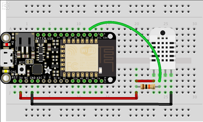

# SimpleWeatherStationESP8266
## Introduction
This is an example of a physical device (Adafruit Feather Huzzah ESP8266) with a sensor connected (DHT22) that implements a simple weather station. The device can be used to connect to an Azure IoT Hub or to an Azure IoT Suite (remote monitoring) solution or to an Azure IoT Central App. Samples for all 3 connection types will be provided later. The device connects to Azure through the [Microsoft Azure IoT Device SDK for C](https://github.com/fsautomata/azure-iot-sdks/blob/master/c/doc/whitepapers/guide_iot_introducing_c_sdk.md).
## Hardware Setup
The only component needed is a [DHT22 temperature and humidity sensor](https://learn.adafruit.com/dht). It can be wired to the [Adafruit HUZZAH ESP8266](https://learn.adafruit.com/adafruit-huzzah-esp8266-breakout?view=all). To work with the device application, wire the DHT22 according to the following figure:

.

## Software mapping from Physical Device to IoT Central App
The physical device software will have different releases with different features. These different devices can also be found as diffrent versions of the same device template on IoT Central. For each different device, we describe which measurements, properties and settings as defined in the IoT Central App are mapped to payload messages in the device application. For the device application, this is basically a collection of JSON definitions.
## Release 1.0.0 features and IoT Central mappings
In this release the following features are available:
* Measure temperature at a fixed interval
* Programmatically set a device location
For this, the following mapping between device and IoT Central App are used:

Device datatype | JSON Name | IoT Central Configuration Type | Remarks
--------------- | --------- | ------------------------------ | -------
float | dht22_Temperature | Measurement | We are using a fixed interval of 10 seconds between measurements.
string | device_location | Device Property | Send to IoT Central only once. This property is in fact a reported device twin value.
